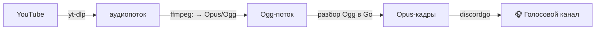

<div align="center">

# 🎵 botgolang

**Музыкальный Discord-бот на Go** — играет звук из YouTube прямо в голосовом канале.


</div>

---

## ✨ Что умеет

| Команда | Описание |
| :--- | :--- |
| `/play <ссылка/название>` | Заходит в твой голосовой канал и играет трек (или ставит в очередь) |
| `/skip` | Пропустить текущий трек |
| `/stop` | Остановить воспроизведение и очистить очередь |
| `/queue` | Показать очередь |
| `/leave` | Выйти из голосового канала |
| `/ping` · `!ping` | Проверка отклика |

---

## 🧠 Как это работает

Discord принимает звук только в формате **Opus** (48 кГц, стерео). Готового
«проигрывателя YouTube» в Go нет, поэтому бот собирает конвейер из внешних утилит:



Перекодировку в Opus делает сам **ffmpeg**, а Go лишь разбирает Ogg-контейнер и
пересылает готовые кадры. Поэтому **cgo не нужен** — проект собирается с `CGO_ENABLED=0`.
Темп 20 мс/кадр держит сам `discordgo` (канал `OpusSend` создаёт естественный backpressure).

---

## 📁 Структура проекта

```
botgolang/
├── cmd/
│   └── bot/
│       └── main.go         # точка входа: читает токен, запускает бота
├── internal/
│   ├── bot/                # Discord-сессия, команды, обработчики
│   │   ├── bot.go          #   создание сессии, интенты, Run()
│   │   ├── commands.go     #   список слэш-команд
│   │   └── handlers.go     #   логика /play, /skip, /stop, /queue, /leave
│   ├── player/             # очередь и проигрыватель (по одному на сервер)
│   │   └── player.go
│   └── audio/              # конвейер звука
│       ├── audio.go        #   yt-dlp → ffmpeg → разбор Ogg/Opus
│       └── audio_test.go   #   тест демультиплексора (с реальным ffmpeg)
├── .env.example
├── .gitignore
├── go.mod / go.sum
└── README.md
```

> Раскладка `cmd/` + `internal/` — стандартная для Go: `internal` нельзя
> импортировать извне модуля, а каждый пакет отвечает за свой слой.

---

## 🚀 Быстрый старт

### 1. Требования

- **Go 1.25+**
- **ffmpeg** и **yt-dlp** в `PATH` (или указать пути через `FFMPEG_PATH` / `YTDLP_PATH`):

  ```powershell
  winget install Gyan.FFmpeg
  winget install yt-dlp.yt-dlp
  ```

### 2. Токен бота

1. [Discord Developer Portal](https://discord.com/developers/applications) → **New Application**.
2. Вкладка **Bot** → скопируй **Token**.
3. Там же включи **MESSAGE CONTENT INTENT**.
4. **OAuth2 → URL Generator**: scopes `bot` + `applications.commands`;
   права `Send Messages`, `Connect`, `Speak`. Открой ссылку и пригласи бота на сервер.

### 3. Запуск

```powershell
$env:DISCORD_TOKEN = "ВАШ_ТОКЕН"
go run ./cmd/bot
```

Затем зайди в голосовой канал и напиши на сервере:

```
/play never gonna give you up
```

> **В GoLand:** Run → Edit Configurations → Go Build, поле _Package path_ = `botgolang/cmd/bot`,
> добавь переменную окружения `DISCORD_TOKEN`.

---

## ⚙️ Конфигурация

| Переменная | Обязательна | Назначение |
| :--- | :---: | :--- |
| `DISCORD_TOKEN` | ✅ | Токен бота |
| `FFMPEG_PATH` | — | Путь к `ffmpeg`, если его нет в `PATH` |
| `YTDLP_PATH` | — | Путь к `yt-dlp`, если его нет в `PATH` |

---

## 🛠️ Разработка

```powershell
go build ./...        # сборка
go vet ./...          # статический анализ
go test ./...         # тесты (тест звука требует ffmpeg)
go run ./cmd/bot      # запуск
```

---

## 🗺️ Дальше можно добавить

- [ ] `/pause` и `/resume`
- [ ] Регулировку громкости
- [ ] Реальные названия треков в очереди (сейчас показывается запрос)
- [ ] Повтор (`/loop`) и перемешивание (`/shuffle`)
- [ ] Поддержку плейлистов

---

<div align="center">
Сделано с ❤️ на Go · discordgo
</div>
