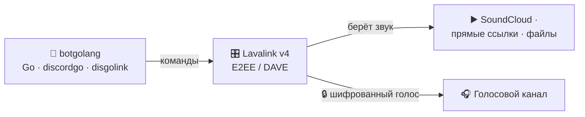

<div align="center">

# 🎵 botgolang

### Многофункциональный Discord-бот на Go
**Музыка · Модерация · Развлечения — всё в одном, быстро и без лишнего**

<br/>

[](https://go.dev)
[](https://github.com/bwmarrin/discordgo)
[](https://lavalink.dev)
[](https://www.docker.com)


<br/>

*Лёгкий, быстрый и аккуратный бот, который оживляет твой сервер: ставит музыку
в голосовых каналах, помогает модераторам и развлекает участников — всё через
понятные слэш-команды. Готов к запуску в один контейнер.*

⭐ **Нравится? Поставь звезду — это лучшая мотивация развивать проект!**

</div>

---

## 🌟 Возможности

<table>
<tr>
<td width="33%" valign="top" align="center">

### 🎵 Музыка
Воспроизведение из **SoundCloud**, по прямым ссылкам и файлам прямо в голосовом
канале. Очередь треков, пропуск, пауза — всё на месте.

</td>
<td width="33%" valign="top" align="center">

### 🛡️ Модерация
**Кик, бан, тайм-аут** и массовая очистка чата. Команды видят только те, у кого
есть права — порядок без хаоса.

</td>
<td width="33%" valign="top" align="center">

### 🎉 Развлечения
**Голосования, кубики, монетка, магический шар** и красивые карточки с инфо
о пользователе и сервере.

</td>
</tr>
</table>

<div align="center">

**⚡ Быстрый** · **🪶 Лёгкий** (без cgo) · **🐳 Docker из коробки** · **🔓 Открытый исходник**

</div>

---

## 📋 Команды

<details open>
<summary><b>🎵 Музыка</b></summary>

<br/>

| Команда | Что делает |
| :--- | :--- |
| `/play <ссылка/название>` | Играть трек или добавить в очередь (поиск по SoundCloud) |
| `/skip` | Пропустить трек — включается следующий из очереди |
| `/pause` | Пауза / продолжить |
| `/stop` | Остановить и выйти из канала |
| `/queue` | Показать очередь |

</details>

<details open>
<summary><b>🎉 Развлечения и информация</b></summary>

<br/>

| Команда | Что делает |
| :--- | :--- |
| `/vote <вопрос> <вариант1> <вариант2> [вариант3] [вариант4]` | Голосование — выбор реакцией 1️⃣2️⃣3️⃣4️⃣ |
| `/poll <вопрос>` | Быстрый опрос да/нет (реакции ✅ / ❌) |
| `/roll [грани]` | Бросить кубик |
| `/8ball <вопрос>` | Магический шар предскажет ответ |
| `/coinflip` | Подбросить монетку |
| `/avatar [@юзер]` | Показать аватар |
| `/userinfo [@юзер]` | Карточка пользователя |
| `/serverinfo` | Карточка сервера |
| `/ping` · `!ping` | Проверка отклика |

</details>

<details open>
<summary><b>🛡️ Модерация</b> <i>— видна только тем, у кого есть права</i></summary>

<br/>

| Команда | Что делает |
| :--- | :--- |
| `/clear <кол-во>` | Удалить последние сообщения (1–100) |
| `/kick <@юзер> [причина]` | Выгнать участника |
| `/ban <@юзер> [причина]` | Забанить участника |
| `/timeout <@юзер> <минуты> [причина]` | Выдать тайм-аут |

</details>

---

## 🧠 Как устроена музыка

Современный Discord шифрует голос «из конца в конец» (протокол **DAVE/E2EE**).
botgolang решает это элегантно: звук обрабатывает **Lavalink** — мощный аудио-сервер,
а бот лишь дирижирует им по сети. Чисто, надёжно и масштабируемо.



> 💡 Вся логика на **Go** собирается в один бинарник **без cgo** (`CGO_ENABLED=0`).
> Источник по умолчанию — **SoundCloud** (стабильно работает и на серверах).
> YouTube требует дополнительной настройки (OAuth/PoToken) из-за защиты от ботов.

---

## 🛠️ Технологии

| Слой | Технология |
| :--- | :--- |
| Язык | **Go 1.25** |
| Discord API | [discordgo](https://github.com/bwmarrin/discordgo) |
| Аудио / голос | [Lavalink v4](https://lavalink.dev) + [disgolink](https://github.com/disgoorg/disgolink) |
| Конфиг | `.env` через [godotenv](https://github.com/joho/godotenv) |
| Деплой | Docker (один контейнер: бот + Lavalink) |

---

## 🐳 Деплой (рекомендуется)

Самый простой способ — **Docker**: в репозитории есть `Dockerfile`, который собирает
**один контейнер** с ботом и Lavalink внутри. Подходит для любого VPS или панели
(EasyPanel, Coolify, Dokploy и т.п.).

**На панели (EasyPanel и подобные):**
1. Источник → **Git** → URL: `https://github.com/wexxxew/botgolang.git`, ветка `main`, путь сборки `/`
2. Способ сборки → **Dockerfile**
3. В **Environment** добавь переменную:
   ```
   DISCORD_TOKEN=твой_токен
   ```
4. Нажми **Deploy** — панель сама соберёт и запустит.

**Или вручную через Docker:**
```bash
docker build -t botgolang .
docker run -e DISCORD_TOKEN=твой_токен botgolang
```

> ✅ Разворачивай на сервере с прямым доступом к Discord (например, ЕС) —
> тогда голос работает без ограничений и бот крутится 24/7.

---

## 💻 Локальный запуск

### Требования
- **Go 1.25+**
- **Java 17+** и `Lavalink.jar` из [релизов](https://github.com/lavalink-devs/Lavalink/releases) — в папку `lavalink/`

### Настройка токена
В [Developer Portal](https://discord.com/developers/applications) включи
**MESSAGE CONTENT INTENT** и пригласи бота (scopes `bot` + `applications.commands`;
права `Connect`, `Speak`, `Send Messages`). Создай файл `.env`:
```dotenv
DISCORD_TOKEN=твой_токен
```

### Запуск — два процесса
```bash
cd lavalink && java -jar Lavalink.jar      # ждём "Lavalink is ready"
go run ./cmd/bot                           # ждём "✅ Lavalink подключён"
```

> Без Lavalink бот тоже работает — просто музыкальные команды сообщат, что музыка
> недоступна. Все остальные команды доступны всегда.

---

## ⚙️ Конфигурация

| Переменная | Обязательна | По умолчанию | Назначение |
| :--- | :---: | :--- | :--- |
| `DISCORD_TOKEN` | ✅ | — | Токен бота |
| `LAVALINK_ADDRESS` | — | `127.0.0.1:2333` | Адрес сервера Lavalink |
| `LAVALINK_PASSWORD` | — | `youshallnotpass` | Пароль Lavalink |
| `YOUTUBE_OAUTH_REFRESH_TOKEN` | — | — | Токен для доступа к YouTube (если нужен) |

---

## 📁 Структура проекта

```
botgolang/
├── cmd/bot/main.go          # точка входа: грузит .env, запускает бота
├── internal/bot/
│   ├── bot.go               # сессия, интенты, подключение к Lavalink
│   ├── commands.go          # описание слэш-команд
│   ├── handlers.go          # маршрутизация + помощники ответов
│   ├── music.go             # музыка: Lavalink, очередь, /play и др.
│   ├── fun.go               # развлечения и информация
│   └── moderation.go        # модерация
├── lavalink/application.yml # конфиг Lavalink
├── Dockerfile               # сборка бот + Lavalink в один контейнер
└── start.sh                 # запуск Lavalink и бота внутри контейнера
```

---

## 🛠️ Разработка

```bash
go build ./...     # сборка
go vet ./...       # статический анализ
go run ./cmd/bot   # запуск
```

---

## 🗺️ Планы

- [ ] 🔁 `/loop` — повтор трека или очереди
- [ ] 🔀 `/shuffle` — перемешать очередь
- [ ] 📻 `/nowplaying` — что играет сейчас + прогресс
- [ ] 🔊 `/volume` — регулировка громкости
- [ ] ⏱️ Таймер для `/vote` с авто-подведением итогов

---

## 🤝 Вклад

PR и идеи приветствуются! Форкай, экспериментируй, открывай issue.
Код разбит по слоям (`bot` / `music` / `fun` / `moderation`) — разобраться легко.

---

## 📄 Документы

- 📜 [Условия использования](TERMS_OF_SERVICE.md)
- 🔒 [Политика конфиденциальности](PRIVACY_POLICY.md)

---

<div align="center">

**Сделано с ❤️ на Go**

`discordgo` · `disgolink` · `Lavalink`

⭐ *Если проект понравился — поставь звезду!*

</div>
