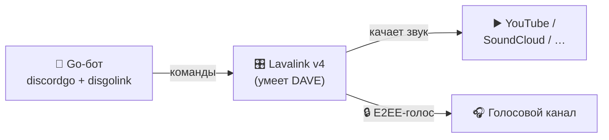

<div align="center">

# 🎵 botgolang

### Универсальный Discord-бот на Go — музыка, модерация и развлечения в одном

*Лёгкий · быстрый · без cgo · с настоящим воспроизведением музыки через Lavalink*

<br/>


</div>

---

<div align="center">

**botgolang** превращает твой сервер в живое место: ставит музыку с YouTube в голосовых
каналах, помогает модераторам наводить порядок и развлекает участников — всё через
понятные слэш-команды.

</div>

---

## 🌟 Возможности

<table>
<tr>
<td width="33%" valign="top">

### 🎵 Музыка
Воспроизведение с YouTube, SoundCloud и др. прямо в голосовом канале.
Очередь треков, пауза, пропуск — всё на месте.

</td>
<td width="33%" valign="top">

### 🛡️ Модерация
Кик, бан, тайм-аут и массовая очистка сообщений.
Команды видны только тем, у кого есть права.

</td>
<td width="33%" valign="top">

### 🎉 Развлечения
Кубики, монетка, магический шар, опросы и карточки с инфо
о пользователе и сервере.

</td>
</tr>
</table>

---

## 📋 Команды

<details open>
<summary><b>🎵 Музыка</b></summary>

| Команда | Описание |
| :--- | :--- |
| `/play <ссылка/название>` | Играть трек или добавить в очередь |
| `/skip` | Пропустить текущий трек |
| `/pause` | Пауза / продолжить |
| `/stop` | Остановить и выйти из канала |
| `/queue` | Показать очередь |

</details>

<details open>
<summary><b>🎉 Развлечения и информация</b></summary>

| Команда | Описание |
| :--- | :--- |
| `/ping` · `!ping` | Проверка отклика |
| `/roll [sides]` | Бросить кубик |
| `/8ball <вопрос>` | Магический шар предскажет ответ |
| `/coinflip` | Подбросить монетку |
| `/avatar [user]` | Показать аватар |
| `/userinfo [user]` | Карточка пользователя |
| `/serverinfo` | Карточка сервера |
| `/poll <вопрос>` | Опрос с реакциями ✅/❌ |

</details>

<details open>
<summary><b>🛡️ Модерация</b> <i>(только для тех, у кого есть права)</i></summary>

| Команда | Описание |
| :--- | :--- |
| `/clear <count>` | Удалить последние сообщения (1–100) |
| `/kick <user> [reason]` | Выгнать участника |
| `/ban <user> [reason]` | Забанить участника |
| `/timeout <user> <minutes> [reason]` | Выдать тайм-аут |

</details>

---

## 🧠 Как устроена музыка

С марта 2026 Discord требует сквозное шифрование голоса (**DAVE / E2EE**), которое
библиотека `discordgo` пока не поддерживает. Поэтому звук отдаём **Lavalink** —
отдельному аудио-серверу (Java), умеющему DAVE. Бот лишь командует им по сети.



Чистая архитектура: discordgo отправляет лишь «зайти в канал» через gateway, а само
шифрованное голосовое соединение и воспроизведение берёт на себя Lavalink. Бонус —
весь Go-код собирается **без cgo** (`CGO_ENABLED=0`).

---

## 📁 Структура проекта

```
botgolang/
├── cmd/bot/main.go         # точка входа: грузит .env, запускает бота
├── internal/bot/
│   ├── bot.go              # сессия, интенты, подключение к Lavalink
│   ├── commands.go         # описание слэш-команд
│   ├── handlers.go         # маршрутизация + помощники ответов
│   ├── music.go            # музыка: Lavalink, очередь, /play и др.
│   ├── fun.go              # развлечения и информация
│   └── moderation.go       # модерация
├── lavalink/
│   └── application.yml     # конфиг Lavalink (jar качается отдельно)
├── .env.example
└── README.md
```

> Раскладка `cmd/` + `internal/` — стандартная для Go: каждый пакет отвечает за свой слой.

---

## 🚀 Быстрый старт

### 1. Требования
- **Go 1.25+**
- **Java 17+** (для Lavalink)
- **Lavalink.jar** в папку `lavalink/` — [скачать из релизов](https://github.com/lavalink-devs/Lavalink/releases)

### 2. Токен
В [Developer Portal](https://discord.com/developers/applications) включи
**MESSAGE CONTENT INTENT** и пригласи бота (scopes `bot` + `applications.commands`,
права `Connect`, `Speak`, `Send Messages`). Создай файл `.env`:

```dotenv
DISCORD_TOKEN=твой_токен
```

### 3. Запуск — два процесса

```powershell
# Терминал 1 — музыкальный сервер
cd lavalink
java -jar Lavalink.jar      # ждём "Lavalink is ready to accept connections."

# Терминал 2 — сам бот
go run ./cmd/bot            # ждём "✅ Lavalink подключён — музыка доступна"
```

Готово — заходи в голосовой канал и пиши `/play <название>` 🎶

> 💡 Lavalink не запущен? Бот всё равно работает — просто музыкальные команды
> скажут, что музыка недоступна. Все остальные команды доступны всегда.

---

## ⚙️ Конфигурация

| Переменная | Обязательна | По умолчанию | Назначение |
| :--- | :---: | :--- | :--- |
| `DISCORD_TOKEN` | ✅ | — | Токен бота |
| `LAVALINK_ADDRESS` | — | `localhost:2333` | Адрес сервера Lavalink |
| `LAVALINK_PASSWORD` | — | `youshallnotpass` | Пароль Lavalink |

---

## 🛠️ Разработка

```powershell
go build ./...     # сборка
go vet ./...       # статический анализ
go run ./cmd/bot   # запуск
```

---

## 📄 Документы

- 📜 [Условия использования (Terms of Service)](TERMS_OF_SERVICE.md)
- 🔒 [Политика конфиденциальности (Privacy Policy)](PRIVACY_POLICY.md)

---

<div align="center">

**Сделано с ❤️ на Go**
`discordgo` · `disgolink` · `Lavalink`

</div>
