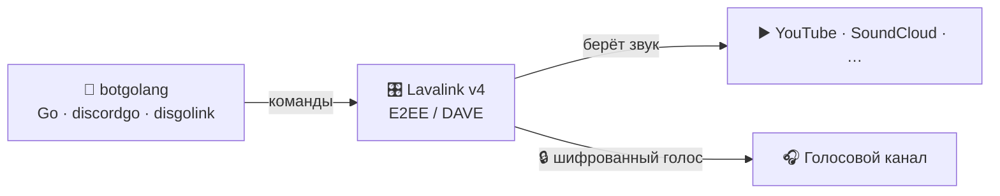

<div align="center">

# 🎵 botgolang

### Многофункциональный Discord-бот на Go
**Музыка · Модерация · Развлечения — всё в одном, быстро и без лишнего**

<br/>

[](https://go.dev)
[](https://github.com/bwmarrin/discordgo)
[](https://lavalink.dev)
[](https://adoptium.net)


<br/>

*Лёгкий, быстрый и аккуратный бот, который оживляет твой сервер:
ставит музыку в голосовых каналах, помогает модераторам и развлекает участников —
всё через понятные слэш-команды.*

⭐ **Нравится? Поставь звезду — это лучшая мотивация развивать проект!**

</div>

---

## 🌟 Почему botgolang

<table>
<tr>
<td width="33%" valign="top" align="center">

### 🎵 Музыка
Воспроизведение с **YouTube, SoundCloud** и других источников прямо в голосовом канале. Очередь, пауза, пропуск — всё на месте.

</td>
<td width="33%" valign="top" align="center">

### 🛡️ Модерация
**Кик, бан, тайм-аут** и массовая очистка чата. Команды видят только те, у кого есть права — порядок без хаоса.

</td>
<td width="33%" valign="top" align="center">

### 🎉 Развлечения
**Кубики, монетка, магический шар, опросы** и красивые карточки с инфо о пользователе и сервере.

</td>
</tr>
</table>

<div align="center">

**⚡ Быстрый** · **🪶 Лёгкий** (один бинарник, без cgo) · **🧩 Понятный код** · **🔓 Открытый исходник**

</div>

---

## 📋 Команды

<details open>
<summary><b>🎵 Музыка</b></summary>

<br/>

| Команда | Что делает |
| :--- | :--- |
| `/play <ссылка/название>` | Играть трек или добавить в очередь |
| `/skip` | Пропустить текущий трек |
| `/pause` | Пауза / продолжить |
| `/stop` | Остановить и выйти из канала |
| `/queue` | Показать очередь |

</details>

<details open>
<summary><b>🎉 Развлечения и информация</b></summary>

<br/>

| Команда | Что делает |
| :--- | :--- |
| `/ping` · `!ping` | Проверка отклика |
| `/roll [грани]` | Бросить кубик |
| `/8ball <вопрос>` | Магический шар предскажет ответ |
| `/coinflip` | Подбросить монетку |
| `/avatar [@юзер]` | Показать аватар |
| `/userinfo [@юзер]` | Карточка пользователя |
| `/serverinfo` | Карточка сервера |
| `/poll <вопрос>` | Опрос с реакциями ✅ / ❌ |

</details>

<details open>
<summary><b>🛡️ Модерация</b> <i>— видна только тем, у кого есть права</i></summary>

<br/>

| Команда | Что делает |
| :--- | :--- |
| `/clear <кол-во>` | Удалить последние сообщения (1–100) |
| `/kick <@юзер> [причина]` | Выгнать участника |
| `/ban <@юзер> [причина]` | Забанить участника |
| `/timeout <@юзер> <минуты> [причина]` | Выдать тайм-аут |

</details>

---

## 🧠 Как устроена музыка

Современный Discord шифрует голос «из конца в конец» (протокол **DAVE/E2EE**).
botgolang решает это элегантно: звук обрабатывает **Lavalink** — мощный аудио-сервер,
а бот лишь дирижирует им по сети. Чисто, надёжно и масштабируемо.



> 💡 Вся логика на **Go** собирается в один бинарник **без cgo** (`CGO_ENABLED=0`) —
> разворачивается где угодно за секунды.

---

## 🛠️ Технологии

| Слой | Технология |
| :--- | :--- |
| Язык | **Go 1.25** |
| Discord API | [discordgo](https://github.com/bwmarrin/discordgo) |
| Аудио / голос | [Lavalink v4](https://lavalink.dev) + [disgolink](https://github.com/disgoorg/disgolink) |
| Конфиг | `.env` через [godotenv](https://github.com/joho/godotenv) |

---

## 🚀 Установка

### 1. Требования
- **Go 1.25+**
- **Java 17+** (для Lavalink) и `Lavalink.jar` из [релизов](https://github.com/lavalink-devs/Lavalink/releases) — положить в папку `lavalink/`

### 2. Токен
В [Discord Developer Portal](https://discord.com/developers/applications) включи
**MESSAGE CONTENT INTENT** и пригласи бота (scopes `bot` + `applications.commands`;
права `Connect`, `Speak`, `Send Messages`). Создай файл `.env`:

```dotenv
DISCORD_TOKEN=твой_токен
```

### 3. Запуск — два процесса

```bash
# 1) Музыкальный сервер
cd lavalink && java -jar Lavalink.jar      # ждём "Lavalink is ready"

# 2) Сам бот
go run ./cmd/bot                           # ждём "✅ Lavalink подключён"
```

Заходи в голосовой канал и пиши `/play <название>` 🎶

> Без Lavalink бот тоже работает — просто музыкальные команды скажут, что музыка
> недоступна. Все остальные команды доступны всегда.

---

## ☁️ Хостинг 24/7 (рекомендуется для музыки)

Для **стабильной музыки и работы без твоего ПК** разверни бота на **VPS** —
лучше всего в регионе с прямым доступом к Discord (ЕС, например Германия/Нидерланды).
Там Lavalink стоит рядом с открытыми голосовыми серверами Discord, и звук идёт
напрямую — **работает идеально и круглосуточно**.

```
[ VPS (Linux) ]
   ├── Lavalink.jar      # java -jar Lavalink.jar
   └── botgolang         # ./bot
```

> ℹ️ **Локально голос может не проходить**, если у сети ограничен доступ к голосовым
> серверам Discord (UDP). Все текстовые команды при этом работают где угодно, а
> музыка раскрывается в полную силу на нормальном хостинге. Docker-развёртывание —
> в планах (см. ниже).

---

## ⚙️ Конфигурация

| Переменная | Обязательна | По умолчанию | Назначение |
| :--- | :---: | :--- | :--- |
| `DISCORD_TOKEN` | ✅ | — | Токен бота |
| `LAVALINK_ADDRESS` | — | `127.0.0.1:2333` | Адрес сервера Lavalink |
| `LAVALINK_PASSWORD` | — | `youshallnotpass` | Пароль Lavalink |

---

## 🗺️ Планы

- [ ] 🐳 Docker / docker-compose (бот + Lavalink в один клик)
- [ ] 🔊 Громкость, `/loop`, `/shuffle`
- [ ] 📝 Реальные названия треков в очереди
- [ ] 🎚️ Аудио-фильтры (бас-буст и др.)
- [ ] 🌐 Интерфейс на нескольких языках

---

## 🤝 Вклад

PR и идеи приветствуются! Форкай, экспериментируй, открывай issue.
Структура простая и разбита по слоям — разобраться легко.

```
botgolang/
├── cmd/bot/main.go         # точка входа
├── internal/bot/           # сессия, команды, обработчики
│   ├── bot.go · commands.go · handlers.go
│   ├── music.go · fun.go · moderation.go
└── lavalink/application.yml # конфиг Lavalink
```

---

## 📄 Документы

- 📜 [Условия использования](TERMS_OF_SERVICE.md)
- 🔒 [Политика конфиденциальности](PRIVACY_POLICY.md)

---

<div align="center">

**Сделано с ❤️ на Go**

`discordgo` · `disgolink` · `Lavalink`

⭐ *Если проект понравился — поставь звезду!*

</div>
